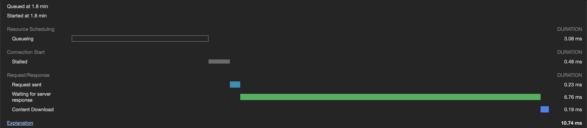
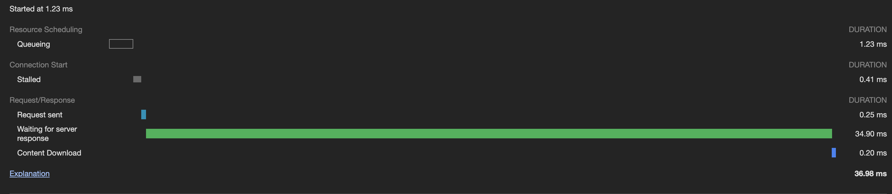

## CDN 

- Signed up for BunnyCDN and created a pull zone for my website.
- Headers like `Cache-Control` control cache behviour. [Docs](https://developer.mozilla.org/en-US/docs/Web/HTTP/Headers/Cache-Control) 
- Is set to `Cache-Control: public, max-age=0, s-maxage=300` for my site.
   - Shared-caches(CDN/proxy): The `s-maxage` is set to 300 seconds to ensure that the content is cached for 5 minutes on the CDN.
   - Private-caches(browsers): The `max-age` is set to 0 seconds to ensure that the content is not cached on the client side.
   - The `public` directive indicates that the response may be cached by any cache.
- Initially, had set the origin to `https://apoorvvardhan.dev` but didn't work as expected. Since I came to know my site redirects in that case to `https://www.apoorvvardhan.dev`. So, changed the origin to `https://www.apoorvvardhan.dev` and it worked as expected. [Reference](https://support.bunny.net/hc/en-us/articles/360000228371-How-to-fix-301-redirects-back-to-my-origin-URL)
- Load of an image from my site -
    - With CDN

        

    - Without CDN
    
        

 
